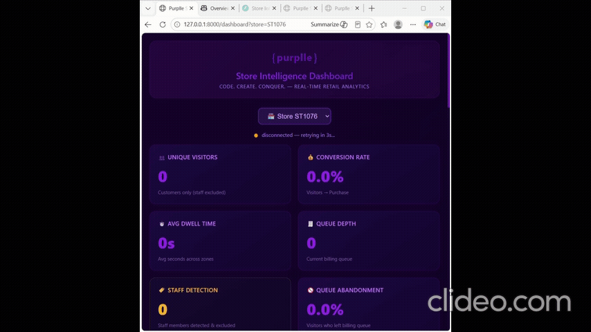

# Store Intelligence — AI-Powered Retail Analytics

End-to-end system that turns raw retail CCTV into live operational intelligence: visitor counting, conversion funnels, zone heatmaps, queue analytics, and anomaly alerts — all served through a containerised FastAPI backend with a real-time HTML dashboard.

---

## 🚀 Quick Start (60 seconds)

```bash
git clone https://github.com/Abhinav7678/store-intelligence.git
cd store-intelligence
docker compose up --build -d
```

Then open:
- **Live Dashboard:** http://localhost:8000/
- **API Docs (Swagger):** http://localhost:8000/docs
- **Health:** http://localhost:8000/health

To populate the dashboard with data, see [Running the Detection Pipeline](#-running-the-detection-pipeline) below.

---

## 🎬 Live Dashboard Demo

Real-time KPIs, funnel chart, queue depth and anomaly alerts updating as detection events flow through the WebSocket fan-out (`/ws`):



> The dashboard is a single-file HTML app served by FastAPI on port 8000. It re-pulls `/stores/{id}/metrics`, `/funnel`, `/heatmap`, and `/anomalies` on every WebSocket push so every tile reflects the live event stream. See [DESIGN.md §1.3](./DESIGN.md) for details.

---

## 📦 Submission Deliverable: Event Log

The event log produced by running the detection pipeline against the provided CCTV clips is committed at:

- **`data/processed/all_events.jsonl`** — combined log across all stores/cameras (893 events)
- **`data/processed/<STORE>_<CAM>_events.jsonl`** — per-camera breakdowns (8 files)

Schema follows `data/sample_events.jsonl`. To regenerate from clips:
```bash
python pipeline/detect.py --all --layout data/store_layout.json
```

To replay into the running API:
```bash
python pipeline/emit.py --input data/processed/all_events.jsonl --api_url http://localhost:8000
```

---

## 📋 What This Does

| Stage | Component | Output |
|---|---|---|
| 1 | YOLOv8 + tracker on CCTV clips | JSONL of behavioural events |
| 2 | POST events to FastAPI | SQLite event store + WebSocket fan-out |
| 3 | Aggregation endpoints | Live metrics, funnel, heatmap, anomalies |
| 4 | HTML dashboard | Real-time KPI tiles + funnel chart |

**Event types:** 8 spec-mandated (`ENTRY`, `EXIT`, `REENTRY`, `ZONE_ENTER`, `ZONE_EXIT`, `ZONE_DWELL`, `BILLING_QUEUE_JOIN`, `BILLING_QUEUE_ABANDON`) plus `BILLING_QUEUE_COMPLETE` (added — needed to make the funnel monotonic; see [DESIGN.md §3.5](./DESIGN.md)).

The pipeline emits the sample-data lowercase form (`entry`, `zone_entered`, `queue_joined`, `queue_completed`, `queue_abandoned`) and the API normalizes to canonical UPPERCASE on ingest.

---

## 🏗️ Architecture

```
CCTV clips (multi-store, multi-camera)
    │
    ▼
┌─────────────────────────────┐
│  Detection Pipeline (host)   │
│  YOLOv8n → tracker → emitter │
│  produces JSONL per camera   │
└────────────┬────────────────┘
             │ POST /events/ingest
             ▼
┌─────────────────────────────┐
│  FastAPI (Docker container)  │
│  • events.db   (SQLite)      │
│  • store_intelligence.db (POS) │
└─────┬──────────────┬─────────┘
      │              │
      ▼              ▼
┌──────────┐   ┌────────────────┐
│ REST API │   │ WebSocket /ws  │
│ /metrics │   │ live broadcast │
│ /funnel  │   └─────┬──────────┘
│ /heatmap │         │
│ /anomalies│        ▼
│ /health  │   ┌────────────────┐
└──────────┘   │ HTML Dashboard │
               │ (port 8000)    │
               └────────────────┘
```

See [DESIGN.md](./DESIGN.md) for full data flow and design decisions.

---

## 🔌 API Endpoints

### Mandatory (per spec)
| Endpoint | Method | Description |
|---|---|---|
| `/events/ingest` | POST | Batch up to 500 events, idempotent on `event_id` |
| `/stores/{store_id}/metrics` | GET | Unique visitors, conversion rate, avg dwell, queue depth |
| `/stores/{store_id}/funnel` | GET | ENTRY → ZONE → QUEUE → PURCHASE with drop-off % |
| `/stores/{store_id}/heatmap` | GET | Per-zone visit count, dwell, score (0-100) |
| `/stores/{store_id}/anomalies` | GET | Queue spike, dead zone, conversion drop alerts |
| `/health` | GET | Per-store `STALE_FEED` detection (>10 min lag) |

### Bonus / Diagnostic
| Endpoint | Method | Description |
|---|---|---|
| `/stores/{store_id}/staff-stats` | GET | Customer vs staff exclusion breakdown — observability hook to verify the staff heuristic isn't over-flagging |
| `/ws` | WS | Real-time event broadcast for the dashboard |
| `/` | GET | Live dashboard (HTML) |
| `/docs` | GET | Swagger UI |

---

## 🎥 Running the Detection Pipeline

The detection pipeline runs on the **host** (not in Docker) because it needs OpenCV + YOLO weights, which would bloat the API image.

### 0. Prerequisites
```bash
# Python 3.10+ in a venv
python -m venv .venv
# Windows: .venv\Scripts\activate     |  Linux/Mac: source .venv/bin/activate
pip install -r requirements.txt -r requirements-cv.txt
```
> On first run, `ultralytics` will auto-download `yolov8n.pt` (~6 MB) into the project root. No manual setup required.

### 1. Drop your CCTV clips into `data/CCTV Footage/<store>/`
Examples:
```
data/CCTV Footage/Store 1/CAM 3 - entry.mp4
data/CCTV Footage/Store 1/CAM 5 - billing.mp4
data/CCTV Footage/Store 2/entry 1.mp4
data/CCTV Footage/Store 2/billing_area.mp4
data/CCTV Footage/Store 2/zone.mp4
```
Camera-to-store mapping is configured in `data/store_layout.json` (committed sample provided).

### 2. Load POS transactions (one-off)
```bash
python pipeline/load_pos.py "data/pos_transactions.csv"
```

### 3. Run detection on all stores
```bash
# Cross-platform (recommended):
python pipeline/detect.py --all --layout data/store_layout.json --start_time "2026-03-08T18:00:00Z"

# Or via the orchestrator script (Linux/Mac/WSL):
bash pipeline/run.sh
```

### 4. Emit events to the API
```bash
# Linux / Mac
for f in data/processed/*_events.jsonl; do
  python pipeline/emit.py --input "$f" --api_url http://localhost:8000
done

# Windows (PowerShell)
Get-ChildItem data/processed/*_events.jsonl | ForEach-Object {
    python pipeline/emit.py --input $_.FullName --api_url http://localhost:8000
}
```

### 5. Open the dashboard
http://localhost:8000/ — KPIs and funnel update live as events flow.

---

## 📁 Project Structure

```
store-intelligence/
├── app/
│   ├── main.py             # FastAPI entrypoint
│   ├── schemas.py          # Pydantic models + event-type normalization
│   ├── ingestion.py        # POST /events/ingest with idempotency + staff backfill
│   ├── metrics.py          # /metrics + /staff-stats
│   ├── funnel.py           # /funnel with drop-off
│   ├── heatmap.py          # /heatmap (count + dwell, end-of-session fallback)
│   ├── anomalies.py        # /anomalies (queue spike, dead zone, conversion drop)
│   ├── health.py           # /health with stale-feed detection
│   ├── sessions.py         # Session reconstruction + POS correlation
│   ├── ws.py               # WebSocket broadcast hub
│   └── models.py           # SQLite schema bootstrap
├── pipeline/
│   ├── detect.py           # YOLOv8 + tracker + zone classifier + event emitter
│   ├── tracker.py          # Re-ID compatible distance tracker (alt impl)
│   ├── emit.py             # JSONL → API ingest
│   ├── load_pos.py         # CSV → store_intelligence.db
│   └── run.sh              # End-to-end orchestrator
├── dashboard/
│   └── index.html          # Live HTML dashboard
├── tests/                  # pytest suite (~78% coverage on app/)
├── docs/
│   └── media/
│       └── dashboard-demo.gif   # Live dashboard recording
├── data/
│   ├── pos_transactions.csv     # POS reference data (committed)
│   ├── sample_events.jsonl      # Reference event schema (provided)
│   ├── store_layout.json        # Zone polygons + camera mappings
│   ├── processed/
│   │   ├── all_events.jsonl     # 📦 Submission deliverable: combined event log
│   │   └── <STORE>_<CAM>_events.jsonl  # Per-camera event logs
│   ├── events.db                # Event store (gitignored, regenerated)
│   └── store_intelligence.db    # POS DB (gitignored, regenerated)
├── DESIGN.md               # Architecture + edge cases + AI decisions
├── CHOICES.md              # 3 deep-dive technical decisions + 1 bonus
├── docker-compose.yml
├── Dockerfile
├── requirements.txt
├── requirements-cv.txt     # Pipeline-only deps (cv2, ultralytics)
└── README.md
```

---

## 🧪 Tests

```bash
pytest tests/ -v --cov=app --cov-report=term-missing
```
Current coverage: **~78%** on `app/`. Tests cover ingest idempotency, metrics math, funnel drop-off, anomaly thresholds, schema validation, session reconstruction, and WebSocket fan-out.

Every test file begins with a `# PROMPT: ... # CHANGES MADE: ...` header recording the AI prompt that scaffolded it and the changes made afterwards (per challenge Part D requirements).

---

## ⚡ Edge Cases Handled

Documented in detail in [DESIGN.md §4](./DESIGN.md#4-edge-case-handling). Summary:

- **Group entry** — per-person tracking, 200-px match radius keeps close-spaced people separate
- **Staff exclusion** — behavioural heuristic, **clip-tuned** thresholds: ≥3 distinct zones AND ≥20 detection frames AND ≥600 source frames (~40 s @ 15 fps); sticky flag with retroactive backfill on ingest
- **Re-entry** — 30 s spatial-match window emits `REENTRY` reusing visitor_id (suppresses inflation)
- **Partial occlusion** — `conf=0.35`; low-conf detections kept and flagged via `is_face_hidden`
- **Queue buildup** — live `queue_depth`, `queue_joined`/`completed`/`abandoned` events with positions
- **Zone flicker** — 0.5 s cooldown suppresses rapid border oscillation
- **Empty store** — endpoints return zeros, never crash
- **Duplicate ingest** — `event_id` PK constraint + `duplicates_ignored` in response
- **Stale feed** — `/health` flags any store with no events in last 10 min
- **DB unavailable** — HTTP 503 with structured body, no stack traces
- **Camera overlap** — mitigated by camera-role separation in `store_layout.json` (entry / floor / billing cameras cover distinct areas); no cross-camera ReID — see [DESIGN.md §9](./DESIGN.md)

---

## 🤖 AI Tools Used

- **GitHub Copilot** — boilerplate, test scaffolding, Pydantic models
- **Claude (Anthropic)** — architecture decisions, edge-case analysis, staff-detection trade-offs
- **ChatGPT** — documentation drafting, test scenario brainstorming

Every test file has a `# PROMPT:` header recording the prompt and what was kept/changed. Three high-impact AI suggestions where I deviated are documented in [DESIGN.md §6](./DESIGN.md).

---

## 🛠️ Tech Stack

| Layer | Choice | Reason |
|---|---|---|
| Detection | YOLOv8 Nano | Fast CPU inference, sufficient accuracy on retail footage |
| Tracking | Distance-based, custom | Lighter than DeepSORT, fixed-camera friendly |
| API | FastAPI | Auto-docs, async, Pydantic validation, type-safe |
| Storage | SQLite (×2) | Zero-infra, portable; events.db + store_intelligence.db (POS) |
| Real-time | WebSocket | Native FastAPI, no extra broker |
| Dashboard | Vanilla HTML + JS | One file, no build step |
| Container | Docker Compose | One-command startup, satisfies acceptance gate |
| Tests | pytest + coverage | Industry standard, integrates with CI |

---

## 📝 Further Reading

- **[DESIGN.md](./DESIGN.md)** — Full architecture, data flow, edge cases, AI-assisted decisions, performance, known limitations
- **[CHOICES.md](./CHOICES.md)** — 3 technical decisions where I deviated from common defaults, with options considered, AI suggestions, and trade-offs

---

## 📜 License

Submission for Purplle Store Intelligence challenge — code is for evaluation purposes.